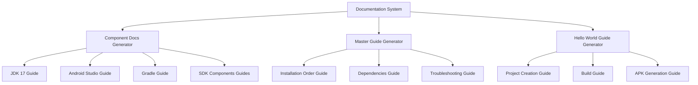

# مستند طراحی

## نمای کلی

این سیستم مجموعه‌ای جامع از مستندات فارسی برای نصب و تست کامپوننت‌های Android Development Tools ایجاد می‌کند. سیستم شامل مستندات جداگانه برای هر کامپوننت، راهنمای کلی نصب، و راهنمای ایجاد پروژه Hello World است.

## معماری

### ساختار کلی سیستم



### ساختار پوشه‌بندی

```
docs/
├── README.md                           # راهنمای کلی
├── 01-jdk17-installation.md           # نصب JDK 17
├── 02-android-studio-installation.md  # نصب Android Studio
├── 03-gradle-installation.md          # نصب Gradle
├── 04-commandline-tools-installation.md # نصب Command Line Tools
├── 05-platform-tools-installation.md  # نصب Platform Tools
├── 06-build-tools-installation.md     # نصب Build Tools
├── 07-sdk-platforms-installation.md   # نصب SDK Platforms
├── 08-system-images-installation.md   # نصب System Images
├── 09-repositories-installation.md    # نصب Repositories
├── 10-sdk-licenses-installation.md    # نصب SDK Licenses
├── 11-hello-world-project.md          # ایجاد پروژه Hello World
└── troubleshooting.md                  # عیب‌یابی کلی
```

## کامپوننت‌ها و رابط‌ها

### 1. Documentation Generator

**مسئولیت:** تولید مستندات برای هر کامپوننت

**رابط‌های ورودی:**
- اطلاعات کامپوننت (نام، نسخه، فایل‌های مورد نیاز)
- مسیرهای نصب پیشنهادی
- دستورات تست

**رابط‌های خروجی:**
- فایل مارک‌داون مستندات نصب
- بخش تست و اعتبارسنجی

### 2. Component Information Database

**کامپوننت‌های پشتیبانی شده:**

#### JDK 17
- **فایل:** `jdk-17.zip`
- **مسیر نصب:** `D:\Android\JDK17`
- **متغیر محیطی:** `JAVA_HOME`
- **تست:** `java -version`

#### Android Studio 2022.3.1
- **فایل:** `android-studio-2022.3.1.20-windows.exe`
- **مسیر نصب:** نصب استاندارد Windows
- **تست:** اجرای Android Studio

#### Gradle 8.0.2
- **فایل:** `gradle-8.0.2-bin.zip`
- **مسیر نصب:** `D:\Android\Gradle`
- **متغیر محیطی:** `PATH`
- **تست:** `gradle -v`

#### Command Line Tools
- **فایل:** `commandlinetools-win-latest.zip`
- **مسیر نصب:** `D:\Android\Sdk\cmdline-tools\latest`
- **تست:** `sdkmanager --list`

#### Platform Tools
- **فایل:** `platform-tools.zip`
- **مسیر نصب:** `D:\Android\Sdk\platform-tools`
- **متغیر محیطی:** `PATH`
- **تست:** `adb version`

#### Build Tools 33.0.2
- **فایل:** `build-tools-33.0.2.zip`
- **مسیر نصب:** `D:\Android\Sdk\build-tools\33.0.2`
- **تست:** بررسی فایل‌های aapt و dx

#### SDK Platforms
- **فایل‌ها:** `sdk-platform-33.zip`, `sdk-platform-30.zip`, `sdk-platform-27.zip`
- **مسیر نصب:** `D:\Android\Sdk\platforms\android-XX`
- **تست:** بررسی فایل android.jar

#### System Images
- **فایل:** `sysimage-google-apis-x86_64-33.zip`
- **مسیر نصب:** `D:\Android\Sdk\system-images\android-33\google_apis\x86_64`
- **تست:** `emulator -list-avds`

#### Repositories
- **فایل‌ها:** `android-m2repository.zip`, `google-m2repository.zip`
- **مسیر نصب:** `D:\Android\Sdk\extras\android\m2repository`, `D:\Android\Sdk\extras\google\m2repository`
- **تست:** بررسی ساختار پوشه‌ها

#### SDK Licenses
- **فایل‌ها:** فایل‌های لایسنس
- **مسیر نصب:** `D:\Android\Sdk\licenses`
- **تست:** `sdkmanager --licenses`

### 3. Installation Order Manager

**ترتیب نصب توصیه‌شده:**
1. JDK 17 (پیش‌نیاز برای همه)
2. Android Studio (اختیاری اما توصیه‌شده)
3. Gradle (مستقل)
4. Command Line Tools (پایه SDK)
5. Platform Tools (ابزارهای اصلی)
6. Build Tools (ابزارهای بیلد)
7. SDK Platforms (پلتفرم‌های هدف)
8. System Images (برای شبیه‌ساز)
9. Repositories (کتابخانه‌ها)
10. SDK Licenses (مجوزها)

### 4. Test Strategy Generator

**انواع تست:**

#### تست فوری (Immediate Test)
- تست‌هایی که بلافاصله پس از نصب قابل اجرا هستند
- مثال: `java -version`, `gradle -v`

#### تست ترکیبی (Combined Test)
- تست‌هایی که نیاز به چندین کامپوننت دارند
- مثال: `sdkmanager --list` (نیاز به JDK + Command Line Tools)

#### تست نهایی (Final Test)
- تست کامل با ایجاد پروژه Hello World
- شامل کامپایل و تولید APK

## مدل‌های داده

### Component Model
```markdown
# نصب [Component Name]

## پیش‌نیازها
- [Prerequisites list]

## فایل‌های مورد نیاز
- [Required files]

## مراحل نصب
1. [Step by step installation]

## تنظیمات متغیرهای محیطی
- [Environment variables]

## تست نصب
### تست فوری
- [Immediate tests]

### تست ترکیبی
- [Combined tests with other components]

## عیب‌یابی
- [Common issues and solutions]
```

### Master Guide Model
```markdown
# راهنمای کامل نصب Android Development Tools

## مقدمه
- [Introduction and overview]

## ترتیب نصب
1. [Ordered list of components]

## وابستگی‌ها
- [Dependencies between components]

## لینک‌های مستندات
- [Links to individual component docs]

## تست نهایی
- [Final validation steps]

## عیب‌یابی کلی
- [General troubleshooting]
```

### Hello World Guide Model
```markdown
# ایجاد و بیلد پروژه Hello World

## پیش‌نیازها
- [Required components]

## ایجاد پروژه
- [Project creation steps]

## تنظیمات پروژه
- [Project configuration]

## بیلد پروژه
- [Build commands and steps]

## تولید APK
- [APK generation process]

## تست APK
- [APK testing methods]
```

## خطا‌یابی

### مدیریت خطاهای رایج

#### خطاهای مسیر (Path Issues)
- مسیرهای اشتباه در متغیرهای محیطی
- فایل‌های گم‌شده یا جابه‌جا شده

#### خطاهای مجوز (Permission Issues)
- عدم دسترسی به پوشه‌های نصب
- مشکلات Windows UAC

#### خطاهای وابستگی (Dependency Issues)
- نصب کامپوننت‌ها در ترتیب اشتباه
- نسخه‌های ناسازگار

#### خطاهای تنظیمات (Configuration Issues)
- متغیرهای محیطی تنظیم نشده
- مسیرهای اشتباه در PATH

### راهکارهای عیب‌یابی

#### بررسی سیستماتیک
1. تأیید وجود فایل‌ها
2. بررسی متغیرهای محیطی
3. تست دستورات پایه
4. بررسی لاگ‌های خطا

#### ابزارهای تشخیص
- دستورات PowerShell برای بررسی متغیرها
- اسکریپت‌های تست خودکار
- راهنمای گام‌به‌گام عیب‌یابی

## ویژگی‌های صحت

*ویژگی یک خصوصیت یا رفتاری است که باید در تمام اجراهای معتبر سیستم برقرار باشد - در واقع، بیانیه‌ای رسمی درباره آنچه سیستم باید انجام دهد. ویژگی‌ها به عنوان پل بین مشخصات قابل خواندن توسط انسان و تضمین‌های صحت قابل تأیید توسط ماشین عمل می‌کنند.*

### Property 1: پوشش کامل مستندات
*برای هر* کامپوننت Android Development که در سیستم تعریف شده، باید دقیقاً یک مستند نصب فارسی و یک راهنمای تست وجود داشته باشد
**Validates: Requirements 1.1, 2.1, 4.1-4.10**

### Property 2: کامل بودن محتوای مستندات
*برای هر* مستند نصب، باید شامل تمام بخش‌های ضروری باشد: مراحل گام‌به‌گام نصب، پیش‌نیازها، مسیرهای نصب پیشنهادی، و در صورت نیاز متغیرهای محیطی
**Validates: Requirements 1.2, 1.3, 1.4, 1.5**

### Property 3: کامل بودن راهنماهای تست
*برای هر* راهنمای تست، باید شامل دستورات تست فوری، نتایج مورد انتظار، و راهنمای عیب‌یابی با خطاهای رایج و راه‌حل‌ها باشد
**Validates: Requirements 2.2, 2.3, 7.2, 7.3, 7.4**

### Property 4: مدیریت تست‌های ترکیبی
*برای هر* کامپوننتی که تست مستقل ندارد، باید راهنمای تست ترکیبی با مشخص کردن کامپوننت‌های پیش‌نیاز وجود داشته باشد
**Validates: Requirements 2.4, 2.5**

### Property 5: انطباق با زبان فارسی
*برای هر* مستند و پیام خطا در سیستم، باید کاملاً به زبان فارسی نوشته شده باشد
**Validates: Requirements 6.5, 7.5**

### Property 6: یکسان بودن نام‌گذاری
*برای هر* فایل مستندات، باید از الگوی نام‌گذاری یکسان پیروی کند
**Validates: Requirements 6.2**

## استراتژی تست

### رویکرد دوگانه تست

**تست‌های واحد**: تأیید موارد خاص، موارد حدی، و شرایط خطا
**تست‌های ویژگی**: تأیید ویژگی‌های جهانی در تمام ورودی‌ها
هر دو مکمل یکدیگر هستند و برای پوشش جامع ضروری‌اند

### تنظیمات تست ویژگی‌محور

**کتابخانه تست ویژگی‌محور**: Pester (PowerShell)
**حداقل تکرار**: 100 تکرار برای هر تست ویژگی
**برچسب‌گذاری تست**: هر تست ویژگی باید با کامنت مرجع به ویژگی طراحی برچسب‌گذاری شود
**فرمت برچسب**: **Feature: android-installation-docs, Property {number}: {property_text}**

### تست واحد (Unit Testing)
- تست هر کامپوننت به صورت مستقل
- تأیید صحت نصب و تنظیمات
- تست موارد خاص و حدی

### تست یکپارچگی (Integration Testing)
- تست تعامل بین کامپوننت‌ها
- تأیید عملکرد کل سیستم

### تست نهایی (End-to-End Testing)
- ایجاد پروژه Hello World کامل
- بیلد و تولید APK موفق
- تأیید عملکرد کامل محیط توسعه

### تست خودکار
- اسکریپت‌های PowerShell برای تست
- بررسی خودکار تنظیمات
- گزارش‌گیری از وضعیت سیستم