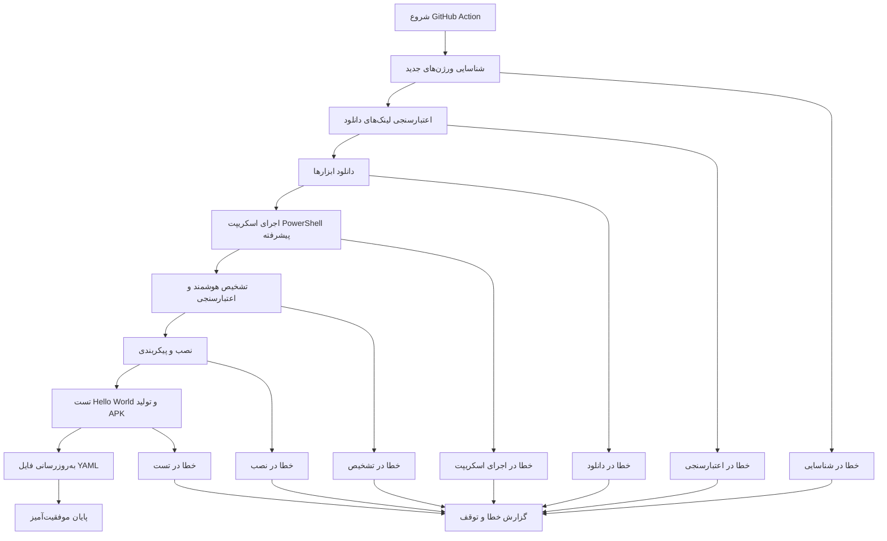

# مستند طراحی

## نمای کلی

این سیستم یک GitHub Action کامل برای شناسایی، تست و به‌روزرسانی آخرین ورژن‌های سازگار ابزارهای توسعه اندروید است. سیستم در محیط ویندوز GitHub Actions اجرا شده و تمام فرایندها را به صورت خودکار انجام می‌دهد.

## معماری

سیستم از معماری pipeline-based استفاده می‌کند که شامل مراحل زیر است:



## کامپوننت‌ها و رابط‌ها

### 1. Version Discovery Service

**مسئولیت**: شناسایی آخرین ورژن‌های ابزارهای اندروید

**رابط‌های ورودی**:
- فهرست ابزارهای مورد نظر
- آدرس‌های API یا وب‌سایت‌های مرجع

**رابط‌های خروجی**:
- لیست ورژن‌های شناسایی شده
- لینک‌های دانلود معتبر

**پیاده‌سازی**:
```yaml
# مثال برای JDK
- name: "شناسایی آخرین ورژن JDK 17"
  run: |
    $jdkVersion = Invoke-RestMethod -Uri "https://api.adoptium.net/v3/info/release_versions?release_type=ga&version=[17,18)"
    $latestJdk17 = $jdkVersion.versions | Where-Object { $_ -like "17.*" } | Sort-Object -Descending | Select-Object -First 1
    echo "JDK_VERSION=$latestJdk17" >> $env:GITHUB_ENV
```

### 2. Download Validator

**مسئولیت**: اعتبارسنجی لینک‌های دانلود و فایل‌های دانلود شده

**رابط‌های ورودی**:
- لینک دانلود
- اندازه مورد انتظار (اختیاری)

**رابط‌های خروجی**:
- وضعیت معتبر/نامعتبر
- اطلاعات فایل (اندازه، نوع)

**پیاده‌سازی**:
```powershell
function Test-DownloadLink {
    param($Url, $MinSize = 1MB)
    
    try {
        $response = Invoke-WebRequest -Uri $Url -Method Head
        $contentLength = [int64]$response.Headers.'Content-Length'
        
        if ($contentLength -lt $MinSize) {
            throw "فایل کوچک‌تر از حد مورد انتظار است"
        }
        
        return @{
            Valid = $true
            Size = $contentLength
            ContentType = $response.Headers.'Content-Type'
        }
    }
    catch {
        return @{
            Valid = $false
            Error = $_.Exception.Message
        }
    }
}
```

### 3. Tool Installer

**مسئولیت**: دانلود و نصب ابزارهای توسعه اندروید

**رابط‌های ورودی**:
- اطلاعات ابزار (نام، ورژن، لینک)
- مسیر نصب

**رابط‌های خروجی**:
- وضعیت نصب
- مسیرهای نصب شده

**پیاده‌سازی**:
```powershell
function Install-AndroidTool {
    param($ToolName, $DownloadUrl, $InstallPath, $ToolType)
    
    Write-Host "دانلود $ToolName..."
    $fileName = Split-Path $DownloadUrl -Leaf
    $downloadPath = Join-Path $env:TEMP $fileName
    
    Invoke-WebRequest -Uri $DownloadUrl -OutFile $downloadPath
    
    switch ($ToolType) {
        "zip" {
            Expand-Archive -Path $downloadPath -DestinationPath $InstallPath -Force
        }
        "exe" {
            Start-Process -FilePath $downloadPath -ArgumentList "/S" -Wait
        }
    }
    
    Remove-Item $downloadPath -Force
}
```

### 4. PowerShell Integration Manager

**مسئولیت**: اجرای اسکریپت `auto-download-and-setup-android-offline.ps1` و مدیریت نتایج

**رابط‌های ورودی**:
- مسیر فایل‌های دانلود شده
- پارامترهای اجرای اسکریپت

**رابط‌های خروجی**:
- وضعیت اجرای اسکریپت
- گزارش HTML تولید شده
- لاگ‌های تفصیلی

**پیاده‌سازی**:
```powershell
function Invoke-PowerShellInstaller {
    param($DownloadPath, $InstallPath)
    
    Write-Host "اجرای اسکریپت نصب آفلاین..."
    
    # اجرای اسکریپت با پارامترهای مناسب
    $scriptResult = & ".\auto-download-and-setup-android-offline.ps1" `
        -Mode "Verbose" `
        -InstallPath $InstallPath `
        -SourcePath $DownloadPath `
        -GenerateReport `
        -Force
    
    # بررسی نتیجه
    if ($LASTEXITCODE -eq 0) {
        Write-Host "✅ اسکریپت با موفقیت اجرا شد"
        return @{
            Success = $true
            APKPath = Get-GeneratedAPKPath
            ReportPath = Get-HTMLReportPath
        }
    } else {
        Write-Host "❌ اسکریپت با خطا مواجه شد"
        return @{
            Success = $false
            Error = "اسکریپت نصب ناموفق بود"
        }
    }
}
```

### 5. YAML Database Manager

**مسئولیت**: مدیریت فایل پایگاه داده ورژن‌ها

**رابط‌های ورودی**:
- اطلاعات ورژن‌های تست شده
- وضعیت تست‌ها

**رابط‌های خروجی**:
- فایل YAML به‌روزرسانی شده

**پیاده‌سازی**:
```powershell
function Update-VersionDatabase {
    param($VersionData, $OutputPath)
    
    $yamlContent = @{
        last_updated = Get-Date -Format "yyyy-MM-dd HH:mm:ss"
        tested_on = "windows-latest"
        tools = @{}
    }
    
    foreach ($tool in $VersionData) {
        $yamlContent.tools[$tool.Name] = @{
            version = $tool.Version
            download_url = $tool.DownloadUrl
            test_status = $tool.TestStatus
            file_size = $tool.FileSize
        }
    }
    
    $yamlContent | ConvertTo-Yaml | Out-File -FilePath $OutputPath -Encoding UTF8
}
```

## مدل‌های داده

### Tool Information Model

```yaml
Tool:
  name: string          # نام ابزار (مثل "JDK", "Gradle")
  version: string       # ورژن (مثل "17.0.8")
  download_url: string  # لینک دانلود
  file_size: integer    # اندازه فایل به بایت
  file_type: string     # نوع فایل (zip, exe, tar.gz)
  install_path: string  # مسیر نصب
  test_status: string   # وضعیت تست (success, failed, pending)
  test_date: datetime   # تاریخ تست
  compatibility: array  # لیست ابزارهای سازگار
```

### Version Database Schema

```yaml
VersionDatabase:
  last_updated: datetime
  tested_on: string     # محیط تست (windows-latest)
  test_result: string   # نتیجه کلی (success, failed)
  hello_world_build: boolean  # وضعیت بیلد Hello World
  tools:
    jdk:
      version: string
      download_url: string
      test_status: string
      file_size: integer
    gradle:
      version: string
      download_url: string
      test_status: string
      file_size: integer
    android_cmdline_tools:
      version: string
      download_url: string
      test_status: string
      file_size: integer
    platform_tools:
      version: string
      download_url: string
      test_status: string
      file_size: integer
    build_tools:
      version: string
      download_url: string
      test_status: string
      file_size: integer
```

### Hello World Project Structure

```
HelloWorldTest/
├── app/
│   ├── src/
│   │   └── main/
│   │       ├── java/
│   │       │   └── com/
│   │       │       └── example/
│   │       │           └── helloworld/
│   │       │               └── MainActivity.java
│   │       ├── res/
│   │       │   ├── layout/
│   │       │   │   └── activity_main.xml
│   │       │   └── values/
│   │       │       └── strings.xml
│   │       └── AndroidManifest.xml
│   └── build.gradle
├── gradle/
│   └── wrapper/
│       ├── gradle-wrapper.jar
│       └── gradle-wrapper.properties
├── build.gradle
├── gradle.properties
└── settings.gradle
```

## خصوصیات صحت

خصوصیت یک ویژگی یا رفتاری است که باید در تمام اجراهای معتبر سیستم برقرار باشد - در واقع، یک بیانیه رسمی درباره آنچه سیستم باید انجام دهد. خصوصیات به عنوان پل ارتباطی بین مشخصات قابل خواندن توسط انسان و تضمین‌های صحت قابل تأیید توسط ماشین عمل می‌کنند.

حالا باید تجزیه و تحلیل پیش‌کار را برای معیارهای پذیرش انجام دهم:

### خصوصیت ۱: شناسایی ورژن معتبر
*برای هر* اجرای GitHub Action، تمام ورژن‌های شناسایی شده باید با الگوهای ورژن‌بندی معتبر مطابقت داشته باشند
**اعتبارسنجی: الزامات ۱.۱، ۱.۲، ۱.۳، ۱.۴، ۱.۵**

### خصوصیت ۲: دانلود و نصب موفق
*برای هر* ابزار شناسایی شده، اگر لینک دانلود معتبر باشد، فرایند دانلود و نصب باید موفقیت‌آمیز باشد
**اعتبارسنجی: الزامات ۲.۱، ۲.۲**

### خصوصیت ۳: یکپارچگی اسکریپت PowerShell
*برای هر* اجرای GitHub Action، اسکریپت `auto-download-and-setup-android-offline.ps1` باید با موفقیت اجرا شده و تمام مراحل تشخیص، نصب و تست را کامل کند
**اعتبارسنجی: الزامات ۲.۲، ۲.۳، ۲.۴، ۷.۱، ۷.۲، ۷.۳**

### خصوصیت ۴: یکپارچگی فایل YAML
*برای هر* به‌روزرسانی موفق، فایل YAML باید حاوی تمام اطلاعات ضروری (ورژن، لینک، تاریخ) باشد
**اعتبارسنجی: الزامات ۳.۱، ۳.۲، ۳.۳**

### خصوصیت ۵: اعتبارسنجی لینک دانلود
*برای هر* لینک دانلود پیدا شده، سیستم باید دسترسی و یکپارچگی فایل را تأیید کند
**اعتبارسنجی: الزامات ۴.۱، ۴.۲، ۴.۳**

### خصوصیت ۶: مدیریت خطا
*برای هر* خطای رخ داده، سیستم باید پیام واضح ارائه داده و فرایند را به درستی متوقف کند
**اعتبارسنجی: الزامات ۲.۵، ۴.۴، ۸.۱، ۸.۲، ۸.۳، ۸.۴، ۸.۵**

### خصوصیت ۷: تلاش مجدد دانلود
*برای هر* دانلود ناموفق، سیستم باید حداکثر ۳ بار تلاش مجدد کند
**اعتبارسنجی: الزامات ۴.۵**

### خصوصیت ۸: لاگ‌گذاری کامل
*برای هر* مرحله اجرا، سیستم باید وضعیت و جزئیات را در لاگ ثبت کند
**اعتبارسنجی: الزامات ۵.۱، ۵.۲، ۵.۳، ۵.۴، ۵.۵**

### خصوصیت ۹: گزارش‌دهی پیشرفته
*برای هر* اجرای موفق اسکریپت، سیستم باید گزارش HTML، لاگ‌های تفصیلی و اطلاعات APK تولید شده را ذخیره کند
**اعتبارسنجی: الزامات ۷.۵**

### خصوصیت ۱۰: به‌روزرسانی تدریجی
*برای هر* فایل YAML موجود، به‌روزرسانی باید اطلاعات قبلی را حفظ کرده و فقط تغییرات جدید را اعمال کند
**اعتبارسنجی: الزامات ۳.۴، ۳.۵**

## مدیریت خطا

### انواع خطاها

1. **خطاهای شبکه**
   - عدم دسترسی به اینترنت
   - خطای ۴۰۴ در لینک‌های دانلود
   - قطع اتصال حین دانلود

2. **خطاهای فایل**
   - فایل ZIP خراب
   - اندازه فایل کمتر از حد انتظار
   - عدم مجوز نوشتن فایل

3. **خطاهای نصب**
   - عدم سازگاری ورژن‌ها
   - کمبود فضای دیسک
   - خطای اجرای installer

4. **خطاهای بیلد**
   - خطاهای کامپایل
   - عدم وجود dependency
   - مشکل در تنظیمات SDK

### استراتژی مدیریت خطا

```powershell
function Handle-Error {
    param($ErrorType, $ErrorMessage, $Context)
    
    $errorInfo = @{
        timestamp = Get-Date -Format "yyyy-MM-dd HH:mm:ss"
        type = $ErrorType
        message = $ErrorMessage
        context = $Context
        action_taken = ""
    }
    
    switch ($ErrorType) {
        "NetworkError" {
            $errorInfo.action_taken = "تلاش مجدد تا ۳ بار"
            Retry-Operation -MaxAttempts 3 -Operation $Context.Operation
        }
        "FileError" {
            $errorInfo.action_taken = "متوقف کردن فرایند و گزارش خطا"
            Stop-Process -ErrorInfo $errorInfo
        }
        "BuildError" {
            $errorInfo.action_taken = "نمایش جزئیات خطای کامپایل"
            Show-BuildDetails -ErrorInfo $errorInfo
        }
    }
    
    Write-ErrorLog -ErrorInfo $errorInfo
}
```

## استراتژی تست

### رویکرد دوگانه تست

این سیستم از دو نوع تست استفاده می‌کند:

1. **تست‌های واحد**: تأیید نمونه‌های خاص، موارد حدی و شرایط خطا
2. **تست‌های مبتنی بر خصوصیت**: تأیید خصوصیات جهانی در تمام ورودی‌ها

### تست‌های واحد

تست‌های واحد بر موارد زیر متمرکز هستند:
- نمونه‌های خاص که رفتار صحیح را نشان می‌دهند
- نقاط ادغام بین کامپوننت‌ها
- موارد حدی و شرایط خطا

### تست‌های مبتنی بر خصوصیت

تست‌های مبتنی بر خصوصیت بر موارد زیر متمرکز هستند:
- خصوصیات جهانی که برای تمام ورودی‌ها برقرار است
- پوشش جامع ورودی از طریق تصادفی‌سازی

### پیکربندی تست‌های مبتنی بر خصوصیت

- حداقل ۱۰۰ تکرار برای هر تست خصوصیت (به دلیل تصادفی‌سازی)
- هر تست خصوصیت باید به خصوصیت مربوطه در مستند طراحی ارجاع دهد
- فرمت برچسب: **Feature: android-version-compatibility-checker, Property {شماره}: {متن خصوصیت}**

### کتابخانه تست مبتنی بر خصوصیت

برای این پروژه از **Pester** (PowerShell testing framework) استفاده می‌شود که قابلیت‌های تست مبتنی بر خصوصیت را پشتیبانی می‌کند.

```powershell
# مثال تست مبتنی بر خصوصیت
Describe "Version Discovery Properties" {
    It "Property 1: Valid version identification" -TestCases @(
        @{ Tool = "JDK"; Pattern = "^17\.\d+\.\d+$" }
        @{ Tool = "Gradle"; Pattern = "^\d+\.\d+(\.\d+)?$" }
    ) {
        param($Tool, $Pattern)
        
        # Feature: android-version-compatibility-checker, Property 1: شناسایی ورژن معتبر
        $version = Get-LatestVersion -Tool $Tool
        $version | Should -Match $Pattern
    }
}
```