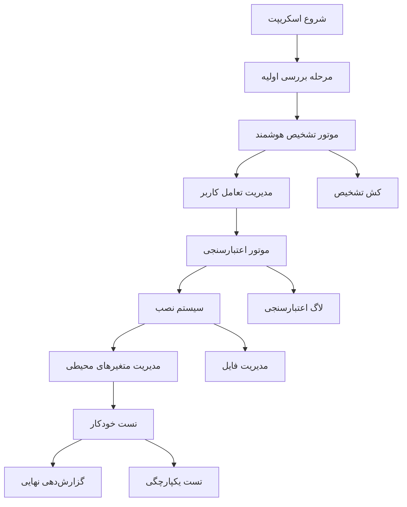
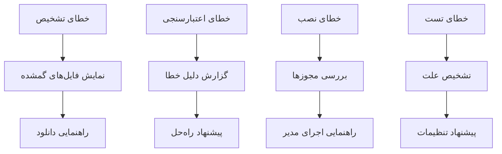

# سند طراحی

## مرور کلی

این سند طراحی یک اسکریپت PowerShell پیشرفته و هوشمند برای نصب آفلاین ابزارهای توسعه اندروید در ویندوز ارائه می‌دهد. اسکریپت اصلی با نام `auto-download-and-setup-android-offline.ps1` بر اساس معماری مدولار طراحی شده که شامل موتور تشخیص هوشمند، سیستم اعتبارسنجی پیشرفته، مدیریت تعاملی کاربر و تست‌های جامع است.

## معماری

### معماری کلی سیستم



### معماری مدولار

اسکریپت شامل ماژول‌های مستقل زیر است:

1. **ماژول تشخیص هوشمند** - تشخیص خودکار کامپوننت‌ها
2. **ماژول اعتبارسنجی** - بررسی یکپارچگی فایل‌ها
3. **ماژول تعامل کاربر** - مدیریت سوالات و پاسخ‌ها
4. **ماژول نصب** - عملیات نصب و کپی
5. **ماژول متغیرهای محیطی** - تنظیم PATH و متغیرها
6. **ماژول تست** - تست‌های خودکار و یکپارچگی
7. **ماژول گزارش‌دهی** - لاگ‌گیری و گزارش نهایی

## کامپوننت‌ها و رابط‌ها

### کامپوننت اصلی: Smart Detection Engine

```powershell
class SmartDetectionEngine {
    [hashtable] $ComponentSignatures
    [hashtable] $DetectionCache
    [string[]] $SearchPaths
    
    [ComponentInfo] DetectComponent([string] $componentType)
    [ComponentInfo[]] DetectAllComponents()
    [bool] ValidateComponentStructure([ComponentInfo] $component)
}
```

**مسئولیت‌ها:**
- تشخیص خودکار کامپوننت‌ها بر اساس امضای فایل
- کش کردن نتایج تشخیص برای بهبود عملکرد
- پشتیبانی از جستجوی بازگشتی هوشمند

**رابط‌ها:**
- ورودی: مسیرهای جستجو، نوع کامپوننت
- خروجی: اطلاعات کامپوننت شناسایی شده

### کامپوننت اصلی: Validation Engine

```powershell
class ValidationEngine {
    [hashtable] $SizeThresholds
    [hashtable] $ValidationRules
    
    [ValidationResult] ValidateZipFile([string] $filePath)
    [ValidationResult] ValidateExecutable([string] $filePath)
    [ValidationResult] ValidateDirectory([string] $dirPath)
    [ValidationResult] ValidateComponent([ComponentInfo] $component)
}
```

**مسئولیت‌ها:**
- اعتبارسنجی یکپارچگی فایل‌های ZIP
- بررسی امضای دیجیتال فایل‌های اجرایی
- تأیید ساختار پوشه‌های SDK

**رابط‌ها:**
- ورودی: مسیر فایل یا پوشه، قوانین اعتبارسنجی
- خروجی: نتیجه اعتبارسنجی با جزئیات خطا

### کامپوننت اصلی: User Interaction Manager

```powershell
class UserInteractionManager {
    [Question[]] $PendingQuestions
    [hashtable] $UserChoices
    
    [void] CollectAllQuestions([ComponentInfo[]] $components)
    [void] AskAllQuestions()
    [UserChoice] GetUserChoice([string] $questionId)
}
```

**مسئولیت‌ها:**
- جمع‌آوری تمام سوالات در ابتدای اجرا
- مدیریت تعامل کاربر بدون وقفه در عملیات
- ذخیره و مدیریت انتخاب‌های کاربر

**رابط‌ها:**
- ورودی: لیست کامپوننت‌ها، سوالات
- خروجی: انتخاب‌های کاربر

### کامپوننت اصلی: Installation Manager

```powershell
class InstallationManager {
    [string] $InstallRoot
    [hashtable] $ComponentPaths
    
    [InstallResult] InstallComponent([ComponentInfo] $component, [UserChoice] $choice)
    [void] ExtractZipSmart([string] $zipPath, [string] $destination)
    [void] CopyComponentFiles([string] $source, [string] $destination)
}
```

**مسئولیت‌ها:**
- نصب هوشمند کامپوننت‌ها
- استخراج بهینه فایل‌های ZIP
- مدیریت مجوزهای فایل

**رابط‌ها:**
- ورودی: اطلاعات کامپوننت، انتخاب کاربر
- خروجی: نتیجه نصب

### کامپوننت اصلی: Environment Manager

```powershell
class EnvironmentManager {
    [hashtable] $EnvironmentVariables
    [string[]] $PathEntries
    
    [void] SetEnvironmentVariable([string] $name, [string] $value, [EnvironmentVariableTarget] $target)
    [void] UpdatePathVariable([string[]] $newPaths)
    [bool] ValidateEnvironmentSetup()
}
```

**مسئولیت‌ها:**
- تنظیم متغیرهای محیطی سیستم و کاربر
- مدیریت PATH بدون تکرار
- اعتبارسنجی تنظیمات محیطی

**رابط‌ها:**
- ورودی: نام متغیر، مقدار، سطح دسترسی
- خروجی: وضعیت تنظیم

### کامپوننت اصلی: Final Test Manager

```powershell
class FinalTestManager {
    [string] $TestProjectPath
    
    [TestResult] CreateHelloWorldProject()
    [TestResult] BuildProjectOffline()
    [bool] ValidateAPKGeneration()
}
```

**مسئولیت‌ها:**
- ایجاد پروژه Hello World اندروید
- کامپایل پروژه به صورت آفلاین
- تأیید تولید APK معتبر

**رابط‌ها:**
- ورودی: مسیر پروژه تست
- خروجی: نتیجه کامپایل و مسیر APK

## مدل‌های داده

### ComponentInfo

```powershell
class ComponentInfo {
    [string] $Name
    [string] $Type
    [string] $Version
    [string] $Path
    [string] $ExecutablePath
    [ComponentStatus] $Status
    [hashtable] $Metadata
}

enum ComponentStatus {
    NotFound
    Found
    Validated
    Installed
    Tested
}
```

### ValidationResult

```powershell
class ValidationResult {
    [bool] $IsValid
    [string] $ErrorMessage
    [hashtable] $Details
    [ValidationLevel] $Level
}

enum ValidationLevel {
    Basic
    Standard
    Comprehensive
}
```

### UserChoice

```powershell
class UserChoice {
    [string] $QuestionId
    [string] $SelectedOption
    [hashtable] $Parameters
    [DateTime] $Timestamp
}
```

### TestResult

```powershell
class TestResult {
    [string] $TestName
    [bool] $Passed
    [string] $Output
    [string] $ErrorMessage
    [TimeSpan] $Duration
}
```

## خصوصیات صحت

*خصوصیت یک ویژگی یا رفتاری است که باید در تمام اجراهای معتبر سیستم برقرار باشد - در واقع، بیانیه‌ای رسمی درباره آنچه سیستم باید انجام دهد. خصوصیات به عنوان پل ارتباطی بین مشخصات قابل خواندن توسط انسان و تضمین‌های صحت قابل تأیید توسط ماشین عمل می‌کنند.*

### تحلیل پیش‌کار معیارهای پذیرش

بر اساس تحلیل الزامات، معیارهای پذیرش زیر برای تست خودکار مناسب هستند:

<function_calls>
<invoke name="prework">
<parameter name="featureName">windows-offline-installer-enhancement

### بازتاب خصوصیات

پس از تحلیل اولیه، خصوصیات زیر برای حذف تکرار بررسی شدند:

**خصوصیات تکراری شناسایی شده:**
- خصوصیت تشخیص JDK، Gradle و SDK می‌توانند در یک خصوصیت جامع "تشخیص کامپوننت" ترکیب شوند
- خصوصیات تست مختلف کامپوننت‌ها می‌توانند در یک خصوصیت "تست کامپوننت" ادغام شوند
- خصوصیات مدیریت متغیرهای محیطی می‌توانند ترکیب شوند

### خصوصیات صحت

**خصوصیت ۱: تشخیص جامع کامپوننت‌ها**
*برای هر* کامپوننت توسعه اندروید (JDK، Gradle، SDK، Platform Tools و غیره)، موتور تشخیص باید بتواند آن را از طریق فایل‌های امضای مشخصه (java.exe، gradle.bat، adb.exe و غیره) شناسایی کند
**اعتبارسنجی: الزامات ۱.۱، ۱.۲، ۱.۳، ۱.۴**

**خصوصیت ۲: اعتبارسنجی یکپارچگی فایل‌ها**
*برای هر* فایل ZIP یا اجرایی که پیدا می‌شود، موتور اعتبارسنجی باید یکپارچگی، اندازه و ساختار آن را تأیید کند
**اعتبارسنجی: الزامات ۲.۱، ۲.۲، ۲.۳**

**خصوصیت ۳: جلوگیری از نصب مجدد**
*برای هر* کامپوننتی که قبلاً نصب شده است، سیستم باید آن را تشخیص داده و از نصب مجدد جلوگیری کند
**اعتبارسنجی: الزامات ۳.۱**

**خصوصیت ۴: مدیریت متغیرهای محیطی**
*برای هر* کامپوننت نصب شده، مدیر متغیرهای محیطی باید متغیرهای مناسب (JAVA_HOME، GRADLE_HOME و غیره) را تنظیم کرده و PATH را بدون تکرار به‌روزرسانی کند
**اعتبارسنجی: الزامات ۴.۱، ۴.۵**

**خصوصیت ۵: تست نهایی با پروژه Hello World**
*برای هر* اجرای کامل اسکریپت، سیستم باید بتواند یک پروژه Hello World اندروید ایجاد کرده، آن را به صورت کاملاً آفلاین کامپایل کرده و APK معتبر تولید کند
**اعتبارسنجی: الزامات ۶.۱، ۶.۵، ۶.۶**

**خصوصیت ۶: جریان کار بررسی اولیه**
*برای هر* اجرای اسکریپت، سیستم باید ابتدا تمام کامپوننت‌ها را بررسی کرده، سوالات را جمع‌آوری کرده و سپس بدون وقفه عملیات نصب را شروع کند
**اعتبارسنجی: الزامات ۱۲.۱، ۱۲.۶**

## مدیریت خطا

### استراتژی مدیریت خطا

اسکریپت از یک سیستم مدیریت خطای چندلایه استفاده می‌کند:

1. **لایه تشخیص**: خطاهای تشخیص کامپوننت
2. **لایه اعتبارسنجی**: خطاهای یکپارچگی فایل
3. **لایه نصب**: خطاهای کپی و استخراج
4. **لایه تست**: خطاهای اجرای دستورات

### انواع خطا و پاسخ‌ها



### کدهای خطا

- **E001**: کامپوننت پیدا نشد
- **E002**: فایل ZIP خراب است
- **E003**: اندازه فایل نامعتبر
- **E004**: مجوز دسترسی کافی نیست
- **E005**: فضای دیسک کافی نیست
- **E006**: تست کامپوننت ناکام
- **E007**: خطای متغیر محیطی

## استراتژی تست

### رویکرد ساده و عملی

**تست نهایی واحد**:
- ایجاد پروژه Hello World اندروید
- کامپایل پروژه با `./gradlew assembleDebug --offline`
- تأیید تولید APK معتبر

این تست واحد نشان‌دهنده عملکرد صحیح تمام کامپوننت‌های نصب شده است:
- JDK برای اجرای Gradle
- Gradle برای مدیریت build
- Android SDK برای کامپایل
- Build Tools برای تولید APK
- Platform Tools برای عملیات SDK

### پیاده‌سازی تست نهایی

```powershell
function Test-AndroidEnvironment {
    $testProject = "$env:TEMP\AndroidTest_$(Get-Date -Format 'yyyyMMdd_HHmmss')"
    
    try {
        # ایجاد پروژه Hello World
        Create-HelloWorldProject $testProject
        
        # کامپایل آفلاین
        Set-Location $testProject
        $buildResult = & gradle assembleDebug --offline
        
        # بررسی APK
        $apkPath = "$testProject\app\build\outputs\apk\debug\app-debug.apk"
        if (Test-Path $apkPath) {
            Write-Host "✅ تست موفق: APK تولید شد در $apkPath" -ForegroundColor Green
            return $true
        } else {
            Write-Host "❌ تست ناکام: APK تولید نشد" -ForegroundColor Red
            return $false
        }
    }
    finally {
        # پاک‌سازی
        if (Test-Path $testProject) {
            Remove-Item $testProject -Recurse -Force
        }
    }
}
```

## جزئیات پیاده‌سازی

### مسیر استخراج ZIP

فایل‌های ZIP در پوشه `.ignoredDownloads` استخراج می‌شوند تا سازماندهی بهتری داشته باشیم:

```powershell
$extractPath = Join-Path ".\.ignoredDownloads" "extracted_$fileName"
```

### الگوریتم تشخیص هوشمند

```powershell
function Find-ComponentSmart {
    param(
        [string] $ComponentType,
        [string[]] $SearchPaths,
        [hashtable] $Signatures
    )
    
    # 1. جستجوی کش
    if ($DetectionCache.ContainsKey($ComponentType)) {
        return $DetectionCache[$ComponentType]
    }
    
    # 2. جستجوی مستقیم در پوشه‌های موجود
    foreach ($path in $SearchPaths) {
        $result = Search-InDirectory $path $Signatures[$ComponentType]
        if ($result) {
            $DetectionCache[$ComponentType] = $result
            return $result
        }
    }
    
    # 3. جستجوی در فایل‌های ZIP
    $zipFiles = Get-ChildItem $SearchPaths -Recurse -Filter "*.zip"
    foreach ($zip in $zipFiles) {
        $result = Search-InZipFile $zip $Signatures[$ComponentType]
        if ($result) {
            $DetectionCache[$ComponentType] = $result
            return $result
        }
    }
    
    return $null
}
```

### الگوریتم اعتبارسنجی ZIP

```powershell
function Test-ZipIntegrity {
    param([string] $ZipPath)
    
    try {
        # بررسی اندازه فایل
        $fileInfo = Get-Item $ZipPath
        if ($fileInfo.Length -lt $MinimumSizes[$ComponentType]) {
            return @{ IsValid = $false; Error = "File too small" }
        }
        
        # بررسی یکپارچگی ZIP
        Add-Type -AssemblyName System.IO.Compression.FileSystem
        $zip = [IO.Compression.ZipFile]::OpenRead($ZipPath)
        $entryCount = $zip.Entries.Count
        $zip.Dispose()
        
        if ($entryCount -eq 0) {
            return @{ IsValid = $false; Error = "Empty archive" }
        }
        
        return @{ IsValid = $true; EntryCount = $entryCount }
    }
    catch {
        return @{ IsValid = $false; Error = $_.Exception.Message }
    }
}
```

### الگوریتم مدیریت PATH

```powershell
function Update-PathVariable {
    param([string[]] $NewPaths)
    
    $currentPath = [Environment]::GetEnvironmentVariable("Path", "Machine")
    $pathArray = $currentPath -split ";"
    
    foreach ($newPath in $NewPaths) {
        # جلوگیری از تکرار
        if ($pathArray -notcontains $newPath) {
            $pathArray += $newPath
            Write-Log "Added to PATH: $newPath"
        }
    }
    
    $updatedPath = $pathArray -join ";"
    [Environment]::SetEnvironmentVariable("Path", $updatedPath, "Machine")
}
```

## بهینه‌سازی عملکرد

### استراتژی‌های بهینه‌سازی

1. **کش تشخیص**: ذخیره نتایج تشخیص برای جلوگیری از جستجوی مجدد
2. **پردازش موازی**: استفاده از PowerShell Jobs برای عملیات مستقل
3. **جستجوی هوشمند**: اولویت‌بندی مسیرهای محتمل
4. **مدیریت حافظه**: آزادسازی منابع پس از استفاده

### مانیتورینگ عملکرد

```powershell
class PerformanceMonitor {
    [hashtable] $Metrics
    [DateTime] $StartTime
    
    [void] StartOperation([string] $operationName)
    [void] EndOperation([string] $operationName)
    [hashtable] GetReport()
}
```

## امنیت

### اقدامات امنیتی

1. **اعتبارسنجی ورودی**: بررسی تمام مسیرها و پارامترهای ورودی
2. **مجوزهای محدود**: اجرای عملیات با حداقل مجوزهای لازم
3. **بررسی امضا**: تأیید امضای دیجیتال فایل‌های اجرایی
4. **لاگ امنیتی**: ثبت تمام عملیات حساس

### مدیریت مجوزها

```powershell
function Test-AdminPrivileges {
    $currentUser = [Security.Principal.WindowsIdentity]::GetCurrent()
    $principal = New-Object Security.Principal.WindowsPrincipal($currentUser)
    return $principal.IsInRole([Security.Principal.WindowsBuiltInRole]::Administrator)
}
```

این طراحی جامع اساس محکمی برای پیاده‌سازی اسکریپت پیشرفته نصب آفلاین ابزارهای توسعه اندروید فراهم می‌کند.