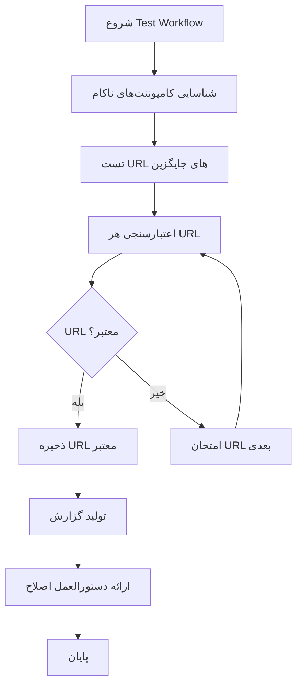
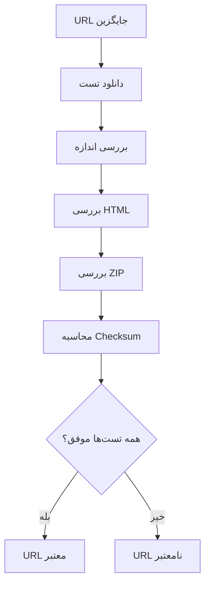

# سند طراحی - رفع کامپوننت‌های ناکام

## نمای کلی

این سند طراحی یک workflow آزمایشی برای رفع مشکل کامپوننت‌های ناکام در workflow اصلی تعریف می‌کند. هدف یافتن URL های جایگزین معتبر و تست آنها قبل از ادغام در workflow اصلی است.

## معماری

### معماری کلی



### معماری تست URL



## کامپوننت‌ها و رابط‌ها

### کامپوننت‌های اصلی

#### 1. URL Alternative Finder
- **مسئولیت**: یافتن URL های جایگزین برای کامپوننت‌های ناکام
- **ورودی**: لیست کامپوننت‌های ناکام
- **خروجی**: لیست URL های جایگزین برای تست

#### 2. URL Tester
- **مسئولیت**: تست و اعتبارسنجی URL های جایگزین
- **ورودی**: URL جایگزین و معیارهای اعتبارسنجی
- **خروجی**: نتیجه تست (موفق/ناکام) و جزئیات

#### 3. Result Aggregator
- **مسئولیت**: جمع‌آوری و گزارش نتایج تست
- **ورودی**: نتایج تست تمام URL ها
- **خروجی**: گزارش JSON و دستورالعمل اصلاح

## مدل‌های داده

### مدل کامپوننت ناکام

```yaml
FailedComponent:
  name: string                    # نام کامپوننت
  original_url: string           # URL اصلی که ناکام شده
  min_size: integer             # حداقل اندازه مورد انتظار
  validation_type: string       # نوع اعتبارسنجی (zip, exe)
  alternative_urls: array       # لیست URL های جایگزین
  expected_filename: string     # نام فایل مورد انتظار
```

### مدل نتیجه تست URL

```yaml
URLTestResult:
  url: string
  component_name: string
  success: boolean
  file_size: integer
  download_time: float
  validation_results:
    size_check: boolean
    html_check: boolean
    zip_integrity: boolean
  error_message: string
  checksum: string
  timestamp: string
```

## لیست کامپوننت‌های ناکام و URL های جایگزین

### Platform Tools

```yaml
platform_tools:
  name: "Platform Tools"
  original_url: "https://dl.google.com/android/repository/platform-tools_r35.0.1-windows.zip"
  min_size: 15728640  # 15MB
  validation_type: "zip"
  alternative_urls:
    - "https://dl.google.com/android/repository/platform-tools_r34.0.5-windows.zip"
    - "https://dl.google.com/android/repository/platform-tools_r33.0.2-windows.zip"
    - "https://dl.google.com/android/repository/platform-tools-latest-windows.zip"
    - "https://developer.android.com/studio/releases/platform-tools"
  expected_filename: "platform-tools.zip"
```

### SDK Platform API 33

```yaml
sdk_platform_33:
  name: "SDK Platform API 33"
  original_url: "https://dl.google.com/android/repository/platform-33_r03.zip"
  min_size: 26214400  # 25MB
  validation_type: "zip"
  alternative_urls:
    - "https://dl.google.com/android/repository/platform-33_r02.zip"
    - "https://dl.google.com/android/repository/platform-33_r01.zip"
    - "https://dl.google.com/android/repository/platforms/android-33/android-33_r03.zip"
  expected_filename: "sdk-platform-33.zip"
```

### Android M2Repository

```yaml
android_m2repository:
  name: "Android M2Repository"
  original_url: "https://dl.google.com/android/repository/android_m2repository_r58.zip"
  min_size: 52428800  # 50MB
  validation_type: "zip"
  alternative_urls:
    - "https://dl.google.com/android/repository/android_m2repository_r57.zip"
    - "https://dl.google.com/android/repository/android_m2repository_r56.zip"
    - "https://dl.google.com/android/repository/android_m2repository_r47.zip"
  expected_filename: "android-m2repository.zip"
```

### Google M2Repository

```yaml
google_m2repository:
  name: "Google M2Repository"
  original_url: "https://dl.google.com/android/repository/google_m2repository_r202.zip"
  min_size: 52428800  # 50MB
  validation_type: "zip"
  alternative_urls:
    - "https://dl.google.com/android/repository/google_m2repository_r201.zip"
    - "https://dl.google.com/android/repository/google_m2repository_r200.zip"
    - "https://dl.google.com/android/repository/google_m2repository_gms_v11_3_rc05_wear_2_0_7.zip"
  expected_filename: "google-m2repository.zip"
```

## الگوریتم‌های تست

### الگوریتم تست URL جایگزین

```bash
test_alternative_url() {
  local url=$1
  local component_name=$2
  local min_size=$3
  local validation_type=$4
  local filename=$5
  
  echo "تست URL جایگزین برای $component_name: $url"
  
  # دانلود فایل
  if ! curl -L -o "test_$filename" "$url"; then
    echo "ERROR: دانلود ناکام"
    return 1
  fi
  
  # بررسی اندازه
  file_size=$(stat -c%s "test_$filename")
  if [ $file_size -lt $min_size ]; then
    echo "ERROR: اندازه کوچک ($file_size bytes, حداقل: $min_size)"
    rm -f "test_$filename"
    return 1
  fi
  
  # بررسی HTML
  if head -c 1024 "test_$filename" | grep -qi -E '(<html|<!DOCTYPE|<head|<body)'; then
    echo "ERROR: محتوای HTML تشخیص داده شد"
    rm -f "test_$filename"
    return 1
  fi
  
  # بررسی ZIP (در صورت نیاز)
  if [ "$validation_type" = "zip" ]; then
    if ! unzip -t "test_$filename" > /dev/null 2>&1; then
      echo "ERROR: فایل ZIP معتبر نیست"
      rm -f "test_$filename"
      return 1
    fi
  fi
  
  # محاسبه checksum
  checksum=$(sha256sum "test_$filename" | cut -d' ' -f1)
  
  echo "SUCCESS: URL معتبر - اندازه: $file_size bytes, checksum: $checksum"
  rm -f "test_$filename"
  return 0
}
```

### الگوریتم تست همه URL ها

```bash
test_all_alternatives() {
  local component_name=$1
  shift
  local urls=("$@")
  
  for url in "${urls[@]}"; do
    echo "تست $url برای $component_name..."
    if test_alternative_url "$url" "$component_name" "$min_size" "$validation_type" "$filename"; then
      echo "✅ URL معتبر پیدا شد: $url"
      echo "$url" >> "valid_urls_$component_name.txt"
      return 0
    else
      echo "❌ URL نامعتبر: $url"
    fi
  done
  
  echo "⚠️ هیچ URL معتبر برای $component_name پیدا نشد"
  return 1
}
```

## خصوصیات صحت

### خصوصیت ۱: تست URL جایگزین جامع
*برای هر* URL جایگزین، تمام بررسی‌های اعتبارسنجی (اندازه، HTML، ZIP) باید اعمال شود
**اعتبارسنجی: الزامات ۶.۱، ۶.۲، ۶.۳**

### خصوصیت ۲: یافتن حداقل یک URL معتبر
*برای هر* کامپوننت ناکام، حداقل یک URL معتبر باید پیدا شود
**اعتبارسنجی: الزامات ۱.۳، ۳.۴، ۴.۴، ۵.۵**

### خصوصیت ۳: گزارش‌دهی کامل
*برای هر* تست انجام شده، نتیجه کامل با جزئیات در گزارش JSON ثبت شود
**اعتبارسنجی: الزامات ۷.۱، ۷.۲، ۷.۳**

## مدیریت خطا

### استراتژی مدیریت خطا

1. **خطای دانلود**: ادامه به URL بعدی
2. **خطای اعتبارسنجی**: ثبت دلیل و ادامه
3. **عدم یافتن URL معتبر**: گزارش و ادامه به کامپوننت بعدی
4. **خطای سیستمی**: توقف و گزارش

## استراتژی تست

### تست‌های واحد
- تست تابع اعتبارسنجی URL
- تست تابع تشخیص HTML
- تست تابع بررسی ZIP

### تست‌های یکپارچگی
- تست کامل workflow آزمایشی
- تست ادغام نتایج در workflow اصلی

### تست‌های مبتنی بر خصوصیت
- تست خصوصیات صحت تعریف شده
- تست با URL های تصادفی