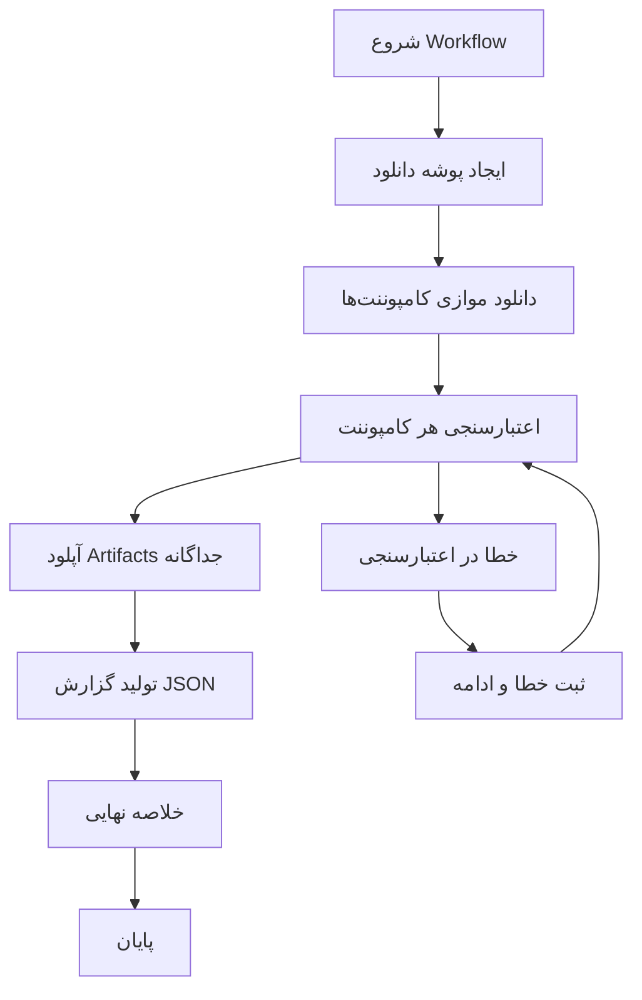
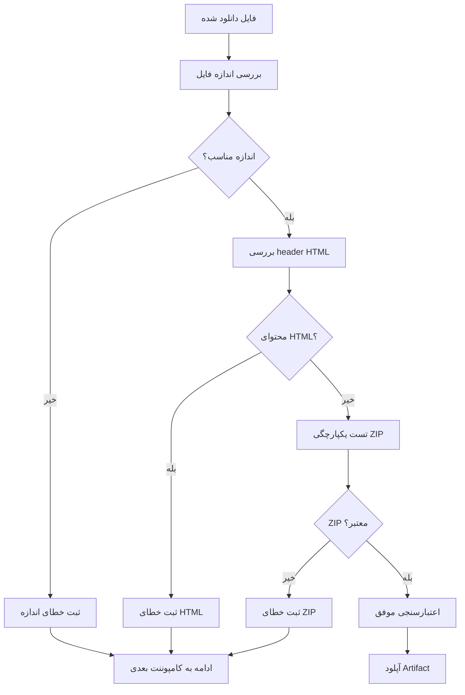

# سند طراحی

## نمای کلی

این سند طراحی یک GitHub Actions workflow جامع و نهایی را تعریف می‌کند که تمام ابزارهای توسعه اندروید مورد نیاز را برای استفاده کاملاً آفلاین دانلود، اعتبارسنجی و بسته‌بندی می‌کند. این workflow باید قوی، دفاعی و شامل اعتبارسنجی جامع باشد تا اطمینان حاصل شود که تمام کامپوننت‌های دانلود شده سالم و آماده استفاده آفلاین هستند.

## معماری

### معماری کلی Workflow



### معماری اعتبارسنجی



## کامپوننت‌ها و رابط‌ها

### کامپوننت‌های اصلی

#### 1. مدیر دانلود (Download Manager)
- **مسئولیت**: دانلود فایل‌ها از URL های مشخص شده
- **ورودی**: لیست URL ها و نام فایل‌های هدف
- **خروجی**: فایل‌های دانلود شده در پوشه downloads/

#### 2. اعتبارسنج (Validator)
- **مسئولیت**: اعتبارسنجی فایل‌های دانلود شده
- **ورودی**: فایل دانلود شده و معیارهای اعتبارسنجی
- **خروجی**: وضعیت اعتبارسنجی (موفق/ناکام) و پیام خطا

#### 3. مدیر Artifact (Artifact Manager)
- **مسئولیت**: آپلود فایل‌های معتبر به عنوان GitHub Artifacts
- **ورودی**: فایل‌های اعتبارسنجی شده
- **خروجی**: Artifacts آپلود شده با نام‌های مناسب

#### 4. گزارش‌ساز (Reporter)
- **مسئولیت**: تولید گزارش‌های JSON و خلاصه نهایی
- **ورودی**: نتایج دانلود و اعتبارسنجی
- **خروجی**: فایل JSON و خلاصه متنی

### رابط‌های کامپوننت‌ها

```yaml
# رابط مدیر دانلود
download_component:
  input:
    - url: string
    - filename: string
    - min_size: integer
  output:
    - file_path: string
    - file_size: integer
    - success: boolean

# رابط اعتبارسنج
validate_component:
  input:
    - file_path: string
    - min_size: integer
    - component_name: string
  output:
    - valid: boolean
    - error_message: string
    - validation_details: object

# رابط مدیر Artifact
artifact_component:
  input:
    - file_path: string
    - artifact_name: string
  output:
    - artifact_url: string
    - upload_success: boolean
```

## مدل‌های داده

### مدل کامپوننت

```yaml
Component:
  name: string                    # نام کامپوننت (مثل "jdk-17")
  display_name: string           # نام نمایشی (مثل "JDK 17")
  url: string                    # URL دانلود مستقیم
  filename: string               # نام فایل محلی
  min_size: integer             # حداقل اندازه مورد انتظار (بایت)
  artifact_name: string         # نام artifact برای آپلود
  version: string               # نسخه کامپوننت
  category: string              # دسته‌بندی (jdk, gradle, sdk, etc.)
  validation_type: string       # نوع اعتبارسنجی (zip, exe, generic)
```

### مدل نتیجه اعتبارسنجی

```yaml
ValidationResult:
  component_name: string
  success: boolean
  file_size: integer
  error_message: string
  validation_checks:
    size_check: boolean
    html_check: boolean
    zip_integrity: boolean
  timestamp: string
  checksum: string
```

### مدل گزارش نهایی

```yaml
FinalReport:
  workflow_id: string
  timestamp: string
  total_components: integer
  successful_downloads: integer
  failed_downloads: integer
  components:
    - component_name: string
      status: string              # "success" | "failed"
      file_size: integer
      checksum: string
      error_message: string
      artifact_name: string
  summary:
    success_rate: float
    total_size: integer
    ready_for_offline: boolean
```

## لیست کامل کامپوننت‌ها

### کامپوننت‌های اصلی

```yaml
components:
  # Android Studio
  - name: "android-studio-2022.3.1"
    display_name: "Android Studio 2022.3.1 Giraffe"
    url: "https://redirector.gvt1.com/edgedl/android/studio/install/2022.3.1.20/android-studio-2022.3.1.20-windows.exe"
    filename: "android-studio-2022.3.1.20-windows.exe"
    min_size: 1073741824  # 1GB
    artifact_name: "android-studio-2022.3.1"
    version: "2022.3.1.20"
    category: "ide"
    validation_type: "exe"

  # JDK 17
  - name: "jdk-17"
    display_name: "JDK 17 Windows x64"
    url: "https://github.com/adoptium/temurin17-binaries/releases/download/jdk-17.0.13%2B11/OpenJDK17U-jdk_x64_windows_hotspot_17.0.13_11.zip"
    filename: "jdk-17.zip"
    min_size: 104857600  # 100MB
    artifact_name: "jdk-17"
    version: "17.0.13+11"
    category: "jdk"
    validation_type: "zip"

  # Gradle نسخه‌های مختلف
  - name: "gradle-8.1"
    display_name: "Gradle 8.1"
    url: "https://services.gradle.org/distributions/gradle-8.1-bin.zip"
    filename: "gradle-8.1-bin.zip"
    min_size: 52428800  # 50MB
    artifact_name: "gradle-8.1"
    version: "8.1"
    category: "gradle"
    validation_type: "zip"

  - name: "gradle-8.0.2"
    display_name: "Gradle 8.0.2"
    url: "https://services.gradle.org/distributions/gradle-8.0.2-bin.zip"
    filename: "gradle-8.0.2-bin.zip"
    min_size: 52428800  # 50MB
    artifact_name: "gradle-8.0.2"
    version: "8.0.2"
    category: "gradle"
    validation_type: "zip"

  - name: "gradle-7.6.3"
    display_name: "Gradle 7.6.3"
    url: "https://services.gradle.org/distributions/gradle-7.6.3-bin.zip"
    filename: "gradle-7.6.3-bin.zip"
    min_size: 52428800  # 50MB
    artifact_name: "gradle-7.6.3"
    version: "7.6.3"
    category: "gradle"
    validation_type: "zip"

  - name: "gradle-7.5"
    display_name: "Gradle 7.5"
    url: "https://services.gradle.org/distributions/gradle-7.5-bin.zip"
    filename: "gradle-7.5-bin.zip"
    min_size: 52428800  # 50MB
    artifact_name: "gradle-7.5"
    version: "7.5"
    category: "gradle"
    validation_type: "zip"

  # Command Line Tools
  - name: "commandlinetools-win-latest"
    display_name: "Android SDK Command-line Tools"
    url: "https://dl.google.com/android/repository/commandlinetools-win-9477386_latest.zip"
    filename: "commandlinetools-win-latest.zip"
    min_size: 52428800  # 50MB
    artifact_name: "commandlinetools-win-latest"
    version: "9477386"
    category: "sdk"
    validation_type: "zip"

  # Platform Tools نسخه‌های مختلف
  - name: "platform-tools-r35.0.1"
    display_name: "Platform Tools r35.0.1"
    url: "https://dl.google.com/android/repository/platform-tools_r35.0.1-windows.zip"
    filename: "platform-tools-r35.0.1.zip"
    min_size: 15728640  # 15MB
    artifact_name: "platform-tools-r35.0.1"
    version: "r35.0.1"
    category: "sdk"
    validation_type: "zip"

  - name: "platform-tools-r34.0.5"
    display_name: "Platform Tools r34.0.5"
    url: "https://dl.google.com/android/repository/platform-tools_r34.0.5-windows.zip"
    filename: "platform-tools-r34.0.5.zip"
    min_size: 15728640  # 15MB
    artifact_name: "platform-tools-r34.0.5"
    version: "r34.0.5"
    category: "sdk"
    validation_type: "zip"

  - name: "platform-tools-r33.0.2"
    display_name: "Platform Tools r33.0.2"
    url: "https://dl.google.com/android/repository/platform-tools_r33.0.2-windows.zip"
    filename: "platform-tools-r33.0.2.zip"
    min_size: 15728640  # 15MB
    artifact_name: "platform-tools-r33.0.2"
    version: "r33.0.2"
    category: "sdk"
    validation_type: "zip"

  # Build Tools نسخه‌های مختلف
  - name: "build-tools-34.0.3"
    display_name: "Build Tools 34.0.3"
    url: "https://dl.google.com/android/repository/build-tools_r34.0.3-windows.zip"
    filename: "build-tools-34.0.3.zip"
    min_size: 41943040  # 40MB
    artifact_name: "build-tools-34.0.3"
    version: "34.0.3"
    category: "sdk"
    validation_type: "zip"

  - name: "build-tools-33.0.2"
    display_name: "Build Tools 33.0.2"
    url: "https://dl.google.com/android/repository/build-tools_r33.0.2-windows.zip"
    filename: "build-tools-33.0.2.zip"
    min_size: 41943040  # 40MB
    artifact_name: "build-tools-33.0.2"
    version: "33.0.2"
    category: "sdk"
    validation_type: "zip"

  # SDK Platforms
  - name: "sdk-platform-33"
    display_name: "SDK Platform API 33"
    url: "https://dl.google.com/android/repository/platform-33_r03.zip"
    filename: "sdk-platform-33.zip"
    min_size: 26214400  # 25MB
    artifact_name: "sdk-platform-33"
    version: "r03"
    category: "sdk"
    validation_type: "zip"

  - name: "sdk-platform-30"
    display_name: "SDK Platform API 30"
    url: "https://dl.google.com/android/repository/platform-30_r03.zip"
    filename: "sdk-platform-30.zip"
    min_size: 26214400  # 25MB
    artifact_name: "sdk-platform-30"
    version: "r03"
    category: "sdk"
    validation_type: "zip"

  - name: "sdk-platform-27"
    display_name: "SDK Platform API 27"
    url: "https://dl.google.com/android/repository/platform-27_r03.zip"
    filename: "sdk-platform-27.zip"
    min_size: 26214400  # 25MB
    artifact_name: "sdk-platform-27"
    version: "r03"
    category: "sdk"
    validation_type: "zip"

  # System Images
  - name: "sysimage-google-apis-x86_64-33"
    display_name: "System Image API 33 x86_64 Google APIs"
    url: "https://dl.google.com/android/repository/sys-img/google_apis/x86_64-33_r15.zip"
    filename: "sysimage-google-apis-x86_64-33.zip"
    min_size: 524288000  # 500MB
    artifact_name: "sysimage-google-apis-x86_64-33"
    version: "r15"
    category: "emulator"
    validation_type: "zip"

  # Emulator Engine نسخه‌های مختلف
  - name: "emulator-33.1.10"
    display_name: "Android Emulator 33.1.10"
    url: "https://dl.google.com/android/repository/emulator-windows_x64-33.1.10.zip"
    filename: "emulator-33.1.10.zip"
    min_size: 104857600  # 100MB
    artifact_name: "emulator-33.1.10"
    version: "33.1.10"
    category: "emulator"
    validation_type: "zip"

  # M2Repository نسخه‌های مختلف
  - name: "android-m2repository-r58"
    display_name: "Android M2Repository r58"
    url: "https://dl.google.com/android/repository/android_m2repository_r58.zip"
    filename: "android-m2repository-r58.zip"
    min_size: 52428800  # 50MB
    artifact_name: "android-m2repository-r58"
    version: "r58"
    category: "repository"
    validation_type: "zip"

  - name: "android-m2repository-r47"
    display_name: "Android M2Repository r47"
    url: "https://dl.google.com/android/repository/android_m2repository_r47.zip"
    filename: "android-m2repository-r47.zip"
    min_size: 52428800  # 50MB
    artifact_name: "android-m2repository-r47"
    version: "r47"
    category: "repository"
    validation_type: "zip"

  - name: "google-m2repository-r202"
    display_name: "Google M2Repository r202"
    url: "https://dl.google.com/android/repository/google_m2repository_r202.zip"
    filename: "google-m2repository-r202.zip"
    min_size: 52428800  # 50MB
    artifact_name: "google-m2repository-r202"
    version: "r202"
    category: "repository"
    validation_type: "zip"

  - name: "google-m2repository-gms-v11.3"
    display_name: "Google M2Repository GMS v11.3"
    url: "https://dl.google.com/android/repository/google_m2repository_gms_v11_3_rc05_wear_2_0_7.zip"
    filename: "google-m2repository-gms-v11.3.zip"
    min_size: 52428800  # 50MB
    artifact_name: "google-m2repository-gms-v11.3"
    version: "gms_v11_3_rc05"
    category: "repository"
    validation_type: "zip"

  # Sources
  - name: "sources-33"
    display_name: "Android Sources API 33"
    url: "https://dl.google.com/android/repository/sources-33_r01.zip"
    filename: "sources-33.zip"
    min_size: 10485760  # 10MB
    artifact_name: "sources-33"
    version: "r01"
    category: "sources"
    validation_type: "zip"

  # CMake نسخه‌های مختلف
  - name: "cmake-3.23.1"
    display_name: "CMake 3.23.1"
    url: "https://dl.google.com/android/repository/cmake-3.23.1-windows.zip"
    filename: "cmake-3.23.1.zip"
    min_size: 10485760  # 10MB
    artifact_name: "cmake-3.23.1"
    version: "3.23.1"
    category: "ndk"
    validation_type: "zip"

  - name: "cmake-3.22.1"
    display_name: "CMake 3.22.1"
    url: "https://dl.google.com/android/repository/cmake-3.22.1-windows.zip"
    filename: "cmake-3.22.1.zip"
    min_size: 10485760  # 10MB
    artifact_name: "cmake-3.22.1"
    version: "3.22.1"
    category: "ndk"
    validation_type: "zip"

  # Constraint Layout نسخه‌های مختلف
  - name: "constraint-layout-2.1.4"
    display_name: "Constraint Layout 2.1.4"
    url: "https://dl.google.com/android/repository/constraint_layout_2.1.4.zip"
    filename: "constraint-layout-2.1.4.zip"
    min_size: 5242880  # 5MB
    artifact_name: "constraint-layout-2.1.4"
    version: "2.1.4"
    category: "library"
    validation_type: "zip"

  - name: "constraint-layout-2.0.4"
    display_name: "Constraint Layout 2.0.4"
    url: "https://dl.google.com/android/repository/constraint_layout_2.0.4.zip"
    filename: "constraint-layout-2.0.4.zip"
    min_size: 5242880  # 5MB
    artifact_name: "constraint-layout-2.0.4"
    version: "2.0.4"
    category: "library"
    validation_type: "zip"
```

### فایل‌های لایسنس SDK

```yaml
sdk_licenses:
  - name: "android-sdk-license"
    content: |
      24333f8a63b6825ea9c5514f83c2829b004d1fee
      84831b9409646a918e30573bab4c9c91346d8abd
  - name: "android-sdk-preview-license"
    content: "84831b9409646a918e30573bab4c9c91346d8abd"
  - name: "google-gdk-license"
    content: "33b6a2e53a7e3b56d3d6f1baf9d38f6f4d64f3a4"
```

## الگوریتم‌های اعتبارسنجی

### اعتبارسنجی اندازه فایل

```bash
validate_file_size() {
  local file_path=$1
  local min_size=$2
  local component_name=$3
  
  file_size=$(stat -c%s "$file_path")
  
  if [ $file_size -lt $min_size ]; then
    echo "ERROR: $component_name file too small ($file_size bytes, minimum: $min_size bytes)"
    return 1
  fi
  
  echo "SUCCESS: $component_name size validation passed ($file_size bytes)"
  return 0
}
```

### تشخیص محتوای HTML

```bash
detect_html_content() {
  local file_path=$1
  local component_name=$2
  
  # بررسی 1024 بایت اول فایل برای تگ‌های HTML
  head_content=$(head -c 1024 "$file_path")
  
  if echo "$head_content" | grep -qi -E '(<html|<!DOCTYPE|<head|<body)'; then
    echo "ERROR: $component_name appears to be HTML content instead of binary"
    return 1
  fi
  
  echo "SUCCESS: $component_name is binary content"
  return 0
}
```

### اعتبارسنجی یکپارچگی ZIP

```bash
validate_zip_integrity() {
  local file_path=$1
  local component_name=$2
  
  if ! unzip -t "$file_path" > /dev/null 2>&1; then
    echo "ERROR: $component_name ZIP integrity check failed"
    return 1
  fi
  
  echo "SUCCESS: $component_name ZIP integrity validated"
  return 0
}
```

### اعتبارسنجی کامل

```bash
validate_component() {
  local file_path=$1
  local min_size=$2
  local component_name=$3
  local validation_type=$4
  
  # بررسی اندازه فایل
  if ! validate_file_size "$file_path" "$min_size" "$component_name"; then
    return 1
  fi
  
  # تشخیص محتوای HTML
  if ! detect_html_content "$file_path" "$component_name"; then
    return 1
  fi
  
  # اعتبارسنجی بر اساس نوع فایل
  case "$validation_type" in
    "zip")
      if ! validate_zip_integrity "$file_path" "$component_name"; then
        return 1
      fi
      ;;
    "exe")
      # برای فایل‌های EXE فقط اندازه و محتوای HTML بررسی می‌شود
      ;;
    *)
      echo "WARNING: Unknown validation type: $validation_type"
      ;;
  esac
  
  echo "SUCCESS: $component_name validation completed successfully"
  return 0
}
```

## ساختار Workflow YAML

### ساختار کلی

```yaml
name: Android Offline Downloader - Final Complete Version

on:
  workflow_dispatch:

jobs:
  download-and-validate:
    runs-on: ubuntu-latest
    
    steps:
      - name: Checkout repository
        uses: actions/checkout@v4

      - name: Create download directory
        run: mkdir -p downloads

      - name: Initialize validation tracking
        run: |
          echo "[]" > validation_results.json
          echo "FAILED_COMPONENTS=" >> $GITHUB_ENV
          echo "SUCCESS_COMPONENTS=" >> $GITHUB_ENV

      # دانلود و اعتبارسنجی هر کامپوننت
      # (تکرار برای هر کامپوننت در لیست)
      
      - name: Generate final report
        run: |
          # تولید گزارش JSON نهایی
          # خلاصه نتایج
          
      - name: Upload final report
        uses: actions/upload-artifact@v4
        with:
          name: download-report
          path: |
            validation_results.json
            final_summary.txt
```

### الگوی دانلود و اعتبارسنجی

```yaml
# الگو برای هر کامپوننت
- name: Download [COMPONENT_NAME]
  id: download-[component-id]
  continue-on-error: true
  run: |
    echo "Downloading [COMPONENT_DISPLAY_NAME]..."
    if curl -L -o downloads/[FILENAME] "[URL]"; then
      echo "download_success=true" >> $GITHUB_OUTPUT
    else
      echo "download_success=false" >> $GITHUB_OUTPUT
      echo "ERROR: Failed to download [COMPONENT_DISPLAY_NAME]"
    fi

- name: Validate [COMPONENT_NAME]
  id: validate-[component-id]
  if: steps.download-[component-id].outputs.download_success == 'true'
  continue-on-error: true
  run: |
    # اعتبارسنجی کامل
    # ثبت نتایج در validation_results.json
    
- name: Upload [COMPONENT_NAME]
  if: steps.validate-[component-id].outputs.validation_success == 'true'
  uses: actions/upload-artifact@v4
  with:
    name: [ARTIFACT_NAME]
    path: downloads/[FILENAME]
```

## خصوصیات صحت (Correctness Properties)

*خصوصیت یک ویژگی یا رفتاری است که باید در تمام اجراهای معتبر سیستم برقرار باشد - در واقع، بیانیه رسمی درباره آنچه سیستم باید انجام دهد. خصوصیات به عنوان پل بین مشخصات قابل خواندن توسط انسان و تضمین‌های صحت قابل تأیید ماشین عمل می‌کنند.*

### خصوصیت ۱: اعتبارسنجی اندازه فایل جامع
*برای هر* فایل دانلود شده، اندازه فایل باید بیشتر یا مساوی حداقل آستانه تعریف شده برای آن کامپوننت باشد
**اعتبارسنجی: الزامات ۲.۱، ۶.۱-۶.۱۱**

### خصوصیت ۲: تشخیص محتوای HTML
*برای هر* فایل دانلود شده، محتوای فایل نباید شامل تگ‌های HTML (مانند <html، <!DOCTYPE، <head، <body) باشد
**اعتبارسنجی: الزامات ۲.۳، ۵.۴**

### خصوصیت ۳: یکپارچگی فایل‌های ZIP
*برای هر* فایل ZIP دانلود شده، فایل باید از نظر ساختاری معتبر باشد و بتوان آن را با موفقیت تست کرد
**اعتبارسنجی: الزامات ۲.۲**

### خصوصیت ۴: ادامه پردازش پس از خطا
*برای هر* کامپوننتی که در دانلود یا اعتبارسنجی ناکام می‌شود، workflow باید خطا را ثبت کرده و پردازش سایر کامپوننت‌ها را ادامه دهد
**اعتبارسنجی: الزامات ۴.۱، ۴.۷**

### خصوصیت ۵: URL های مستقیم باینری
*برای هر* URL دانلود، محتوای برگشتی باید فایل باینری مستقیم باشد نه صفحه HTML یا redirect
**اعتبارسنجی: الزامات ۵.۱، ۵.۳**

### خصوصیت ۶: نام‌گذاری Artifact های منحصربه‌فرد
*برای هر* کامپوننت اعتبارسنجی شده، نام artifact باید منحصربه‌فرد و شامل شناسه نسخه باشد
**اعتبارسنجی: الزامات ۳.۲، ۳.۳**

### خصوصیت ۷: تولید گزارش JSON کامل
*برای هر* اجرای workflow، یک فایل JSON شامل تمام کامپوننت‌ها با نسخه، اندازه فایل و checksum تولید شود
**اعتبارسنجی: الزامات ۹.۵**

### خصوصیت ۸: قفل نسخه URL ها
*برای هر* URL مربوط به SDK، آدرس باید شامل شماره revision یا نسخه صریح باشد و از کلمات کلیدی قابل تغییر مانند "latest" استفاده نکند
**اعتبارسنجی: الزامات ۱۱.۱، ۱۱.۴**

## مدیریت خطا

### استراتژی مدیریت خطا

1. **خطاهای دانلود**: ثبت خطا، ادامه به کامپوننت بعدی
2. **خطاهای اعتبارسنجی**: ثبت جزئیات خطا، ادامه پردازش
3. **خطاهای آپلود**: تلاش مجدد یک بار، سپس ثبت خطا
4. **خطاهای سیستمی**: توقف کامل workflow

### فرمت پیام‌های خطا

```bash
# فرمت استاندارد پیام خطا
echo "ERROR: [COMPONENT_NAME] - [ERROR_TYPE]: [DETAILED_MESSAGE]"

# مثال‌ها
echo "ERROR: JDK-17 - SIZE_CHECK: File too small (45MB, minimum: 100MB)"
echo "ERROR: Gradle-8.1 - HTML_CONTENT: Downloaded file appears to be HTML redirect page"
echo "ERROR: Platform-Tools - ZIP_INTEGRITY: Archive is corrupted or incomplete"
```

### ثبت خطاها در JSON

```json
{
  "component_name": "jdk-17",
  "status": "failed",
  "error_type": "size_check",
  "error_message": "File too small (45MB, minimum: 100MB)",
  "timestamp": "2026-01-03T10:30:00Z",
  "file_size": 47185920,
  "expected_min_size": 104857600
}
```

## استراتژی تست

### رویکرد دوگانه تست

**تست‌های واحد**:
- تست موارد خاص و edge case ها
- تست نقاط ادغام بین کامپوننت‌ها
- تست شرایط خطا و موارد استثنا

**تست‌های مبتنی بر خصوصیت**:
- تست خصوصیات جهانی در تمام ورودی‌ها
- پوشش جامع ورودی از طریق تصادفی‌سازی

### پیکربندی تست‌های مبتنی بر خصوصیت

- حداقل ۱۰۰ تکرار برای هر تست خصوصیت (به دلیل تصادفی‌سازی)
- هر تست خصوصیت باید به خصوصیت سند طراحی خود ارجاع دهد
- فرمت تگ: **Feature: github-actions-workflow, Property {number}: {property_text}**

### مثال‌های تست

```bash
# تست خصوصیت ۱: اعتبارسنجی اندازه فایل
# Feature: github-actions-workflow, Property 1: اعتبارسنجی اندازه فایل جامع
test_file_size_validation() {
  for i in {1..100}; do
    # تولید فایل تصادفی با اندازه‌های مختلف
    # تست اعتبارسنجی اندازه
    # تأیید رفتار مورد انتظار
  done
}

# تست خصوصیت ۲: تشخیص محتوای HTML
# Feature: github-actions-workflow, Property 2: تشخیص محتوای HTML
test_html_detection() {
  for i in {1..100}; do
    # تولید فایل‌های تصادفی با محتوای HTML و باینری
    # تست تشخیص HTML
    # تأیید تشخیص صحیح
  done
}
```

### تعادل تست‌های واحد

- تست‌های واحد برای مثال‌های خاص و edge case ها مفید هستند
- از نوشتن تست‌های واحد زیاد خودداری کنید - تست‌های مبتنی بر خصوصیت پوشش ورودی‌های زیادی را مدیریت می‌کنند
- تست‌های واحد باید روی موارد زیر متمرکز باشند:
  - مثال‌های خاص که رفتار صحیح را نشان می‌دهند
  - نقاط ادغام بین کامپوننت‌ها
  - Edge case ها و شرایط خطا
- تست‌های خصوصیت باید روی موارد زیر متمرکز باشند:
  - خصوصیات جهانی که برای تمام ورودی‌ها برقرار هستند
  - پوشش جامع ورودی از طریق تصادفی‌سازی