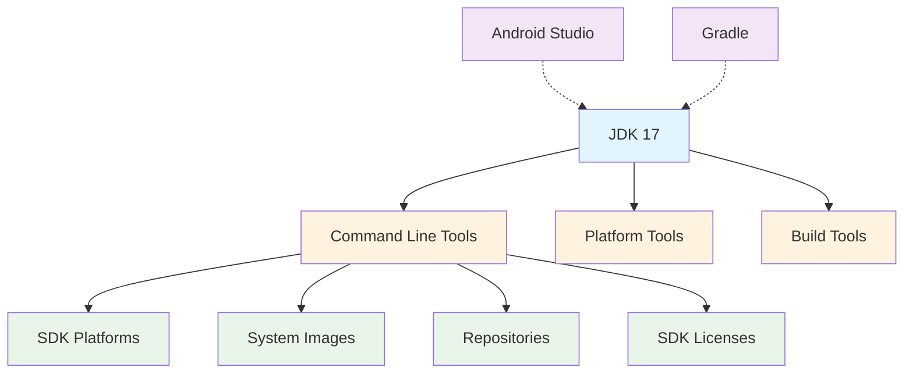

# راهنمای کامل نصب Android Development Tools

## مقدمه

این مجموعه مستندات راهنمای کاملی برای نصب آفلاین تمامی ابزارهای مورد نیاز توسعه اندروید ارائه می‌دهد. تمام کامپوننت‌ها به صورت آفلاین و بدون نیاز به اتصال اینترنت قابل نصب هستند.

## ترتیب توصیه‌شده نصب

برای نصب موفق تمام کامپوننت‌ها، لطفاً ترتیب زیر را رعایت کنید:

1. [نصب JDK 17](01-jdk17-installation.md) - پیش‌نیاز برای همه کامپوننت‌ها
2. [نصب Android Studio](02-android-studio-installation.md) - اختیاری اما توصیه‌شده
3. [نصب Gradle](03-gradle-installation.md) - مستقل از سایر کامپوننت‌ها
4. [نصب Command Line Tools](04-commandline-tools-installation.md) - پایه SDK
5. [نصب Platform Tools](05-platform-tools-installation.md) - ابزارهای اصلی
6. [نصب Build Tools](06-build-tools-installation.md) - ابزارهای بیلد
7. [نصب SDK Platforms](07-sdk-platforms-installation.md) - پلتفرم‌های هدف
8. [نصب System Images](08-system-images-installation.md) - برای شبیه‌ساز
9. [نصب Repositories](09-repositories-installation.md) - کتابخانه‌ها
10. [نصب SDK Licenses](10-sdk-licenses-installation.md) - مجوزها

## وابستگی‌های بین کامپوننت‌ها

### نمودار روابط کامپوننت‌ها

### کامپوننت‌های پایه (بدون وابستگی):
- **JDK 17** - پیش‌نیاز اصلی برای همه کامپوننت‌ها
- **Android Studio** - اختیاری، اما توصیه‌شده
- **Gradle** - مستقل، اما نیاز به JDK دارد

### کامپوننت‌های وابسته به JDK:
- **Command Line Tools** - پایه SDK، نیاز به JDK دارد
- **Platform Tools** - ابزارهای اصلی مانند ADB
- **Build Tools** - ابزارهای بیلد و کامپایل

### کامپوننت‌های وابسته به Command Line Tools:
- **SDK Platforms** - پلتفرم‌های مختلف Android
- **System Images** - تصاویر سیستم برای شبیه‌ساز
- **Repositories** - کتابخانه‌های AndroidX و Google
- **SDK Licenses** - مجوزهای SDK

### توضیح رنگ‌ها در نمودار:
- 🔵 **آبی**: کامپوننت اصلی (JDK)
- 🟣 **بنفش**: کامپوننت‌های اختیاری
- 🟠 **نارنجی**: کامپوننت‌های وابسته به JDK
- 🟢 **سبز**: کامپوننت‌های وابسته به Command Line Tools

## تست نهایی

پس از نصب تمام کامپوننت‌ها:
- [ایجاد پروژه Hello World](11-hello-world-project.md)

## عیب‌یابی

در صورت بروز مشکل:
- [راهنمای عیب‌یابی کلی](troubleshooting.md)

## فهرست کامل مستندات

### 📋 مستندات نصب کامپوننت‌ها:

#### کامپوننت‌های پایه:
- [📁 01 - نصب JDK 17](01-jdk17-installation.md) - پیش‌نیاز اصلی
- [📁 02 - نصب Android Studio](02-android-studio-installation.md) - محیط توسعه
- [📁 03 - نصب Gradle](03-gradle-installation.md) - ابزار بیلد

#### ابزارهای SDK:
- [📁 04 - نصب Command Line Tools](04-commandline-tools-installation.md) - پایه SDK
- [📁 05 - نصب Platform Tools](05-platform-tools-installation.md) - ADB و ابزارهای اصلی
- [📁 06 - نصب Build Tools](06-build-tools-installation.md) - ابزارهای کامپایل

#### پلتفرم‌ها و تصاویر:
- [📁 07 - نصب SDK Platforms](07-sdk-platforms-installation.md) - API 33, 30, 27
- [📁 08 - نصب System Images](08-system-images-installation.md) - تصاویر شبیه‌ساز

#### کتابخانه‌ها و مجوزها:
- [📁 09 - نصب Repositories](09-repositories-installation.md) - AndroidX و Google
- [📁 10 - نصب SDK Licenses](10-sdk-licenses-installation.md) - مجوزهای SDK

### 🚀 راهنماهای تکمیلی:
- [📁 11 - ایجاد پروژه Hello World](11-hello-world-project.md) - تست نهایی
- [🔧 عیب‌یابی کلی](troubleshooting.md) - حل مشکلات رایج

### 📊 خلاصه مستندات:
| شماره | نام کامپوننت | وضعیت | وابستگی |
|-------|-------------|--------|----------|
| 01 | JDK 17 | ✅ کامل | - |
| 02 | Android Studio | ✅ کامل | JDK 17 |
| 03 | Gradle | ✅ کامل | JDK 17 |
| 04 | Command Line Tools | ✅ کامل | JDK 17 |
| 05 | Platform Tools | ✅ کامل | JDK 17 |
| 06 | Build Tools | ✅ کامل | JDK 17 |
| 07 | SDK Platforms | ✅ کامل | Command Line Tools |
| 08 | System Images | ✅ کامل | Command Line Tools |
| 09 | Repositories | ✅ کامل | Command Line Tools |
| 10 | SDK Licenses | ✅ کامل | Command Line Tools |
| 11 | Hello World | ✅ کامل | همه کامپوننت‌ها |

---

**نکته مهم:** تمام مستندات به زبان فارسی نوشته شده‌اند و برای نصب آفلاین طراحی شده‌اند.